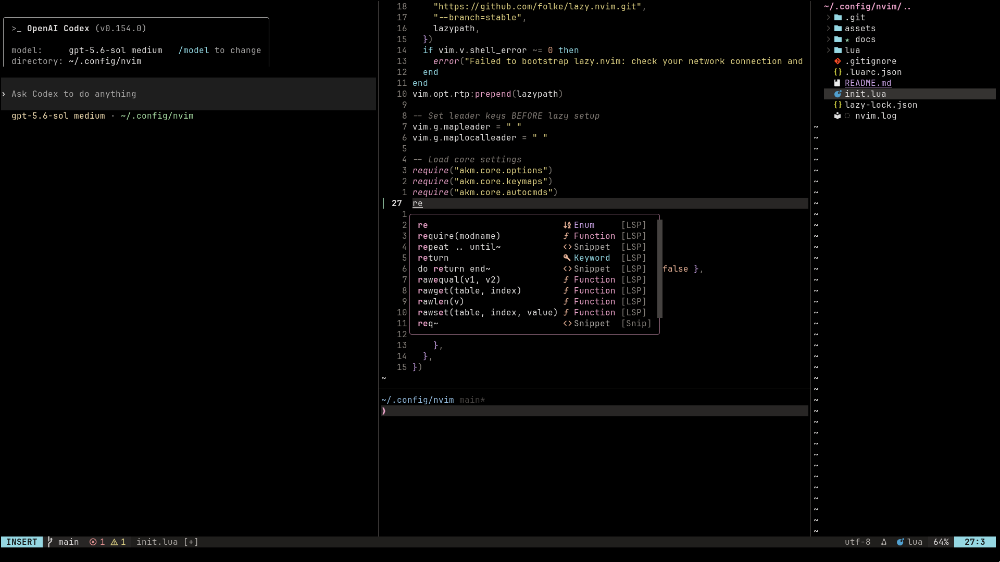

<div align="center">
  <pre>
┌───────────────────────────┐
│  n e o v i m . r c  /  9x │
└───────────────────────────┘
  </pre>

  <p>A small, fast Neovim setup for late-night coding.</p>

  <code>lua · neovim 0.12+ · meowsoot night</code>
  <br><br>
  <a href="#installation">install</a> ·
  <a href="#keybindings">keys</a> ·
  <a href="#features">plugins</a> ·
  <a href="#troubleshooting">help</a>
</div>



> Requires **Neovim 0.12+** and **tree-sitter-cli 0.26.1+**. On Windows, use the [windows branch](https://github.com/ashwani1330/neovimrc/tree/windows).

<a id="installation"></a>

## `01 / install`

```bash
mv ~/.config/nvim ~/.config/nvim.bak
mv ~/.local/share/nvim ~/.local/share/nvim.bak
git clone https://github.com/ashwani1330/neovimrc.git ~/.config/nvim
nvim
```

On first launch, `lazy.nvim` installs the plugins and Treesitter parsers. Run `:checkhealth` when it finishes.

<details>
<summary>system dependencies</summary>

Alongside Neovim, install a C compiler, `git`, `ripgrep`, `fd`, `curl`, `tar`, and the Treesitter CLI from your package manager or an official release binary—not npm.

```bash
# Ubuntu / Debian
sudo apt update && sudo apt install neovim build-essential ripgrep fd-find git

# Fedora / RHEL
sudo dnf install neovim gcc make ripgrep fd-find git

# Arch Linux
sudo pacman -S neovim base-devel ripgrep fd git tree-sitter

# macOS
brew install neovim ripgrep fd gcc tree-sitter
```

Mason also needs Node.js for JavaScript-based language servers, Python for `debugpy`, and optionally Rust/Cargo for compiled tooling.
</details>

---

<a id="keybindings"></a>

## `02 / keys`

Leader: `Space`

<details>
<summary>show keymaps</summary>

### files / windows

| Key | Action |
| --- | --- |
| `<leader>pv` | Toggle File Explorer (NvimTree) |
| `<leader>e` / `-` | Edit Parent Directory (Oil.nvim) |
| `<leader>w` | Save File |
| `<leader>q` | Quit |
| `<leader>Q` | Force Quit All |
| `Ctrl+h/j/k/l` | Navigate between splits |
| `Ctrl+Arrows` | Resize splits |
| `<C-\>` | Toggle Terminal |
| `<leader>fb` | Switch Buffers (Telescope) |

### lsp / code

| Key | Action |
| --- | --- |
| `gd` | Go to Definition |
| `K` | Hover Documentation |
| `<leader>vrr` | Find References |
| `<leader>vca` | Code Action |
| `<leader>vrn` | Rename Symbol |
| `<leader>vd` | Show Diagnostics (Float) |
| `<leader>vws` | Workspace Symbols |
| `[d` / `]d` | Previous / Next Diagnostic |
| `<leader>f` | Format File |

### search / telescope

| Key | Action |
| --- | --- |
| `<leader>ff` | Find Files |
| `<leader>fg` | Live Grep (Search text) |
| `<leader>fr` | Recent Files |
| `<leader>fw` | Grep String (Word under cursor) |
| `<leader>fc` | Fuzzy find in current buffer |
| `<leader>fs` | Document Symbols |
| `<leader>px` | Project/Telescope Commands |
| `<leader>fh` | Help Tags |
| `<leader>fk` | Keymaps |

### ai / copilot

| Key | Action |
| --- | --- |
| **Ghost Text** |  |
| `Alt+Enter` | Accept Suggestion |
| `Alt+l` | Accept Next Word |
| `Alt+Backspace` | Dismiss Suggestion |
| `Alt+]` | Next Suggestion |
| `Alt+[` | Previous Suggestion |
| **Chat Agent** |  |
| `<leader>aa` | Toggle Chat Sidebar |
| `<leader>aq` | Quick Chat Input |
| `<leader>ae` | Explain Code (Visual) |
| `<leader>af` | Fix Bug (Visual) |
| `<leader>at` | Generate Tests (Visual) |

### git / fugitive + gitsigns

| Key | Action |
| --- | --- |
| `<leader>gs` | Git Status |
| `<leader>gc` | Git Commit |
| `<leader>gp` | Git Push |
| `<leader>gP` | Git Pull |
| `<leader>gd` | Git Diff |
| `<leader>gl` | Git Log |
| `]c` / `[c` | Next / Previous Hunk |
| `<leader>hs` | Stage Hunk |
| `<leader>hr` | Reset Hunk |
| `<leader>hp` | Preview Hunk |
| `<leader>tb` | Toggle Blame Ghost Text |

### debug / dap

| Key | Action |
| --- | --- |
| `F5` | Start / Continue |
| `F10` | Step Over |
| `F11` | Step Into |
| `F12` | Step Out |
| `<leader>db` | Toggle Breakpoint |
| `<leader>dB` | Conditional Breakpoint |
| `<leader>du` | Toggle Debug UI |
| `<leader>dr` | Open REPL |
| `<leader>dt` | Terminate |

### utility

| Key | Action |
| --- | --- |
| `<leader>u` | Toggle UndoTree |
| `<leader>um` | Toggle Markdown rendering |
| `Ctrl+Space` (normal / visual) | Expand Treesitter selection |
| `Backspace` (visual) | Shrink Treesitter selection |
| `<leader>xx` | Toggle Trouble (Diagnostics) |
| `<leader>h` | Clear Search Highlight |
| `<leader>r` | Replace word under cursor |
| `Alt+j/k` | Move lines up/down |

</details>

---

<a id="features"></a>

## `03 / plugins`

| Area | Includes |
| --- | --- |
| Code | Native LSP, Mason, nvim-cmp, LuaSnip, Treesitter |
| Find | Telescope, Oil, NvimTree |
| AI | Copilot suggestions and chat |
| Debug | Python, Rust, C, and C++ adapters |
| Git | Gitsigns and Fugitive |
| Writing | Rendered Markdown, LaTeX, and CSV alignment |
| UI | Meowsoot night, Lualine, and rounded windows |

---

<a id="troubleshooting"></a>

## `04 / help`

<details>
<summary>Telescope FZF is missing</summary>

Install `make` and a C compiler, then run `:Lazy build telescope-fzf-native.nvim`.
</details>

<details>
<summary>Treesitter highlighting is missing</summary>

Confirm `tree-sitter --version` is 0.26.1 or newer, then run `:Lazy build nvim-treesitter`.
</details>

<details>
<summary>Icons look wrong</summary>

Use a patched [Nerd Font](https://www.nerdfonts.com/) in your terminal.
</details>

<details>
<summary>Markdown or LaTeX does not render</summary>

Install the `markdown`, `markdown_inline`, and `latex` parsers. For math conversion, run `uv tool install pylatexenc` and keep `~/.local/bin` on your `PATH`. Try the [Markdown preview](docs/markdown-preview.md) and toggle rendering with `<leader>um`.
</details>

<details>
<summary>Language servers or Python debugging are unavailable</summary>

Inspect tools with `:Mason` and active clients with `:checkhealth vim.lsp`. Python debugging uses Mason's `debugpy` adapter and the active project interpreter.
</details>

---

<div align="center">
  <pre>-- eof · see you after midnight --</pre>
  
</div>
